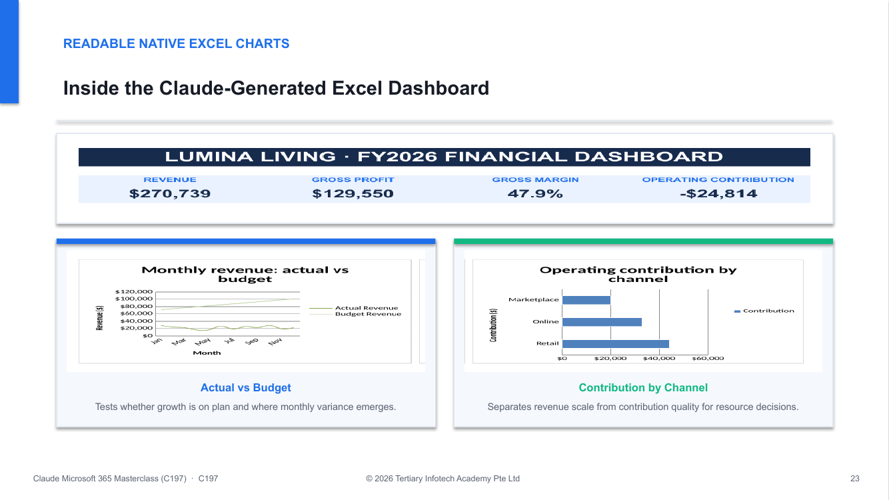

<div align="center">

# Claude Microsoft 365 Masterclass

[](https://www.tertiarycourses.com.sg/claude-microsoft-365-masterclass.html)
[](#course-package)
[](labs/README.md)
[](#course-package)

**Build one governed company workflow across Claude, Word, Excel, PowerPoint, Outlook, Claude Cowork and Claude Code.**

[Course Page](https://www.tertiarycourses.com.sg/claude-microsoft-365-masterclass.html) · [Lab Index](labs/README.md) · [Learner Guide](<LG-Claude Microsoft 365 Masterclass (C197).md>) · [Courseware](courseware/)

</div>



## Course package

This repository contains the complete non-WSQ package for **C197 Claude Microsoft 365 Masterclass**: a 101-slide visual presentation, detailed Learner Guide, Lesson Plan and 11 connected lab folders. It uses one fictional Singapore company, **Lumina Living Pte Ltd**, so plans, policies, analysis, charts, presentations, Outlook work and automations share one evidence chain.

| Item | Scope |
|---|---|
| Duration | 1 day · 7.5 instructional hours |
| Topics | 4 aligned sections |
| Activities | 11 hands-on company activities |
| Office files | Realistic `.docx`, `.xlsx` and `.pptx` samples in every lab folder |
| Controls | Source traceability, formula checks, approval records and human send gates |

## What learners build

1. Governed Claude and Microsoft 365 operating-surface, permission and prompt contracts.
2. A marketing plan, three-year strategy, sustainability report section and flexible-work HR policy in Word.
3. A formula-driven financial model, three native Excel charts and an executive dashboard.
4. A ten-slide strategic and marketing PowerPoint with native charts and source notes.
5. An Outlook triage and approved-draft workflow that never silently sends messages.
6. A scoped Claude Cowork planning project and a Claude Code daily-brief automation.

## Lab sequence

| Topic | Labs | Company activities |
|---|---:|---|
| Governed foundations | 1–3 | Select the Claude surface; map Microsoft 365 context and permissions; build the prompt-and-review contract |
| Planning, reporting and policy | 4–6 | Marketing plan; strategic plan; sustainability reporting and HR policy |
| Analysis and executive story | 7–8 | Excel financial dashboard; strategic and marketing PowerPoint |
| Agentic coordination | 9–11 | Outlook triage and drafts; Claude Cowork; Claude Code automation |

Open [labs/README.md](labs/README.md) for the activity-by-activity index. Each lab folder is self-contained and includes:

- a realistic Lumina Living company brief and Claude-generated Word sample;
- a working Excel workbook and reusable approval log;
- an editable executive PowerPoint starter; and
- a detailed README with full prompts, procedures, tests and troubleshooting.

Lab 7 contains the main finance dashboard, Lab 8 contains the richer executive deck, and Lab 11 adds safe local automation scripts and inputs.

## Project structure

```text
C197-Claude-Microsoft-365-Masterclass/
├── CLAUDE.md                         # Project operating contract
├── CONTEXT.md                        # Persistent project context
├── LG-Claude Microsoft 365 Masterclass (C197).md
├── courseware/
│   ├── Claude Microsoft 365 Masterclass (C197)-v2.0.pptx
│   ├── Claude Microsoft 365 Masterclass (C197)-v2.0.pdf
│   ├── LG-*.docx / LG-*.pdf
│   ├── LP-*.docx / LP-*.pdf
│   └── archive/                      # Superseded local versions
└── labs/
    ├── README.md
    ├── tools.md
    └── lab-01-* … lab-11-*/
        ├── README.md
        ├── *.docx / *.xlsx / *.pptx
        └── templates/
```

## Getting started

```bash
git clone https://github.com/tertiarycourses/C197-Claude-Microsoft-365-Masterclass.git
cd C197-Claude-Microsoft-365-Masterclass
```

Then review [labs/tools.md](labs/tools.md), open the [lab index](labs/README.md), and complete Labs 1–11 in order. Classroom credentials are supplied privately by the trainer and are never stored in published courseware.

## Product distinctions taught in the course

- **Claude for Microsoft 365** works in Word, Excel, PowerPoint and Outlook.
- The **Microsoft 365 connector** retrieves authorised organisational context subject to tenant consent and the signed-in user's permissions.
- **Claude Cowork** is Anthropic's task-oriented desktop workflow for scoped files, projects and connected tools.
- **Copilot Cowork** is a separate Microsoft 365 Copilot experience with Microsoft licensing and governance.
- **Claude Code** can coordinate approved local scripts and MCP connectors for repeatable work processes.

## License

Educational course material for **Claude Microsoft 365 Masterclass (C197)**. © 2026 Tertiary Infotech Academy Pte Ltd. All rights reserved.

<div align="center">

[Tertiary Courses](https://www.tertiarycourses.com.sg) · [C197 Course Page](https://www.tertiarycourses.com.sg/claude-microsoft-365-masterclass.html)

</div>
